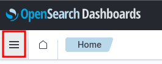
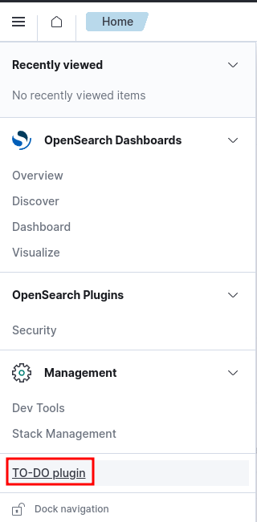
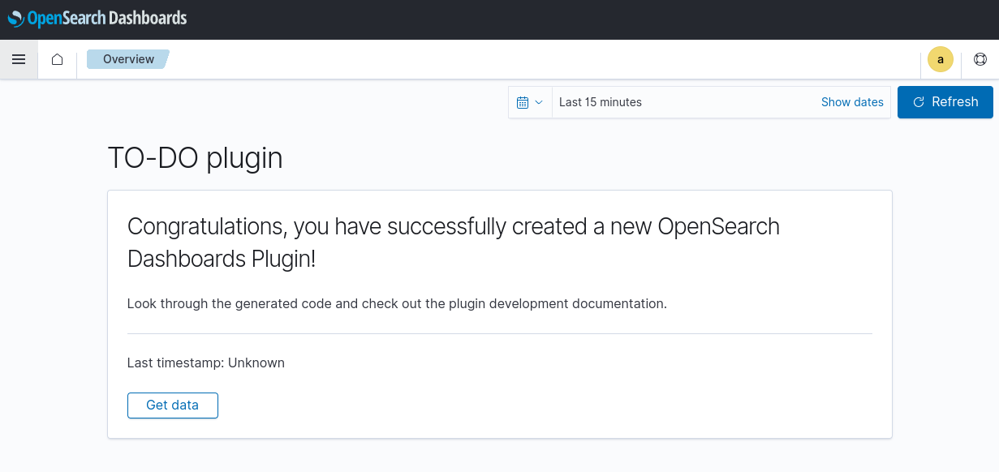

# Set up the development environment

## Requirements

The developer environment is defined through a `docker-compose.yml` file.

To deploy it, you need one of the following:

-   [Docker Desktop][docker-desktop]
-   [Docker Engine][docker-engine]
-   [Compose standalone][docker-compose]

> The recent versions of `docker` CLI has a built-in `compose` command that is similar
> to the `docker-compose` standalone. If your `docker` CLI thas the builtin-in `compose`
> command, you don't need to install it. See the help of your `docker` CLI using:
>
> ```shell
> docker --help
> ```

### Virtual memory

You'll need to increase the virtual memory limit in your system to run OpenSearch /
Elastic.

On Linux, you can increase the limits by running the following command as **root**:

```shell
sysctl -w vm.max_map_count=262144
```

Additional information [here][vm-max-count].

## Development environment

The `docker-compose.yml` file defines the development environment, which is composed by
the following services:

-   **os1**: OpenSearch node v2.14.0, also known as the _indexer_.
-   **osd**: OpenSearch Dashboards v2.14.0 (in development mode).

The **osd** service exposes its internal port 5601 and maps it using the host's 5601 port.
Be sure that this port is free to use.

This container also has the following [volumes][docker-volumes]:

-   plugin's source code directory ([src/](./src/)), which is mounted to the
    `/home/node/kbn/plugins/custom_plugin` directory within the container.
-   configuration files for OpenSearch Dashboards. **You do not need to edit this file**.

### The Docker Compose environment

> Use `docker-compose` instead if you are using the **standalone** version of Compose.

Before starting the environment, check that the port `5601` from your machine is not in
use, or change it in the `docker-compose.yml` file to any other port.

```yml
# docker-compose.yml
- ports
  - 5601:5601
```

The number on the left is the port from your machine.

#### Start

Using a terminal, place yourself in the same folder as the `docker-compose.yml` file and
start the environment as follows:

```shell
docker compose up -d
```

Output:

```
[+] Running 3/3
 ⠿ Network dev_environment_default  Created                                 0.0s
 ⠿ Container dev_environment-os1-1  Healthy                                12.4s
 ⠿ Container dev_environment-osd-1  Started                                12.7s
```

Check the containers are running:

```shell
docker compose ps
```

Output:

```log
NAME                    COMMAND                  SERVICE             STATUS              PORTS
dev_environment-os1-1   "./opensearch-docker…"   os1                 running (healthy)   9200/tcp, 9300/tcp, 9600/tcp, 9650/tcp
dev_environment-osd-1   "tail -f /dev/null"      osd                 running             0.0.0.0:5601->5601/tcp, :::5601->5601/tcp
```

#### Stop

```shell
docker compose stop
```

#### Destroy

```shell
docker compose down
```

#### Summary

-   `docker` CLI

    | Action          | Command              |
    | --------------- | -------------------- |
    | Start           | docker compose up -d |
    | Stop            | docker compose stop  |
    | Stop and remove | docker compose down  |

-   `docker-compose` standalone

    | Action          | Command              |
    | --------------- | -------------------- |
    | Start           | docker-compose up -d |
    | Stop            | docker-compose stop  |
    | Stop and remove | docker-compose down  |

### The OpenSearch Dashboards server

The OpenSearch Dashboards server does not start automatically in development mode. You
need to do this manually.

The easiest way to develop is to [attach][attach-container] a Visual Studio Code instance
to the container.

Access the container and run the following command, being at the `/home/node/kbn` path:

```shell
yarn start --no-base-path
```

Output:

```log
yarn run v1.22.19
$ node scripts/opensearch_dashboards --dev --no-base-path
  log   [10:40:58.819] [info][plugins-service] Plugin "dataSourceManagement" has been disabled since the following direct or transitive dependencies are missing or disabled: [dataSource]
  log   [10:40:58.824] [info][plugins-service] Plugin "dataSource" is disabled.
  log   [10:40:58.824] [info][plugins-service] Plugin "visTypeXy" is disabled.
  log   [10:40:58.982] [info][plugins-service] Plugin initialization disabled.
  log   [10:40:58.995] [warning][savedobjects-service] Skipping Saved Object migrations on startup. Note: Individual documents will still be migrated when read or written.
np bld    log   [10:41:00.496] [info][@osd/optimizer] initialized, 0 bundles cached
np bld    log   [10:41:00.497] [warning][@osd/optimizer] only building [v7dark,v7light] themes, customize with the OSD_OPTIMIZER_THEMES environment variable
 watching for changes  (2134 files)
np bld    log   [10:41:01.204] [info][@osd/optimizer] starting worker [13 bundles]
np bld    log   [10:41:01.205] [info][@osd/optimizer] starting worker [13 bundles]
np bld    log   [10:41:01.206] [info][@osd/optimizer] starting worker [12 bundles]
np bld    log   [10:41:01.209] [info][@osd/optimizer] starting worker [13 bundles]
server    log   [10:41:04.873] [info][plugins-service] Plugin "dataSourceManagement" has been disabled since the following direct or transitive dependencies are missing or disabled: [dataSource]
server    log   [10:41:04.880] [info][plugins-service] Plugin "dataSource" is disabled.
server    log   [10:41:04.881] [info][plugins-service] Plugin "visTypeXy" is disabled.
server    log   [10:41:05.115] [info][plugins-system] Setting up [39] plugins: [usageCollection,opensearchDashboardsUsageCollection,opensearchDashboardsLegacy,mapsLegacy,share,opensearchUiShared,legacyExport,embeddable,expressions,data,home,console,apmOss,management,indexPatternManagement,advancedSettings,savedObjects,dashboard,visualizations,visTypeTimeline,timeline,visTypeTable,visTypeVega,visTypeMarkdown,visBuilder,tileMap,regionMap,inputControlVis,visualize,customPlugin,charts,visTypeVislib,visTypeTagcloud,visTypeTimeseries,visTypeMetric,discover,savedObjectsManagement,securityDashboards,bfetch]
server    log   [10:41:08.972] [info][savedobjects-service] Waiting until all OpenSearch nodes are compatible with OpenSearch Dashboards before starting saved objects migrations...
server    log   [10:41:09.058] [info][savedobjects-service] Starting saved objects migrations
server    log   [10:41:09.112] [info][savedobjects-service] Creating index .kibana_1.
server    log   [10:41:09.362] [info][savedobjects-service] Pointing alias .kibana to .kibana_1.
server    log   [10:41:09.454] [info][savedobjects-service] Finished in 350ms.
server    log   [10:41:09.483] [info][plugins-system] Starting [39] plugins: [usageCollection,opensearchDashboardsUsageCollection,opensearchDashboardsLegacy,mapsLegacy,share,opensearchUiShared,legacyExport,embeddable,expressions,data,home,console,apmOss,management,indexPatternManagement,advancedSettings,savedObjects,dashboard,visualizations,visTypeTimeline,timeline,visTypeTable,visTypeVega,visTypeMarkdown,visBuilder,tileMap,regionMap,inputControlVis,visualize,customPlugin,charts,visTypeVislib,visTypeTagcloud,visTypeTimeseries,visTypeMetric,discover,savedObjectsManagement,securityDashboards,bfetch]
server    log   [10:41:11.325] [info][listening] Server running at http://0.0.0.0:5601
server    log   [10:41:11.495] [info][server][OpenSearchDashboards][http] http server running at http://0.0.0.0:5601
np bld    log   [10:42:10.955] [success][@osd/optimizer] 51 bundles compiled successfully after 70.9 sec, watching for changes
```

The server is ready when you see the following log:

```log
server    log   [12:40:34.503] [info][server][OpenSearchDashboards][http] http server running at http://0.0.0.0:5601
```

The first time the application is started, the code has to be optimized. This can take
some minutes. When completed, you will see a log as this one:

```log
np bld    log   [10:42:10.955] [success][@osd/optimizer] 51 bundles compiled successfully after 70.9 sec, watching for changes
```

To stop the server, use **CTRL+C** in the console where the process is running.

#### Access the OpenSearch Dashboards web UI

You can access to the server through your browser in http://0.0.0.0:5601.
5601 is the default port in the environment configuration.

Credentials to login in the UI are:

```js
username: admin;
password: Wazuh-1234;
```

If you see the following message, then the most likely cause is that the code optimization
process has not finished yet. Wait a few minutes a try again.


#### Access the Custom Plugin web UI

1. With the OpenSearch Dashboards server running, access to the server through the browser.

1. Open the menu:

    

1. Click on the custom plugin:

    

1. Custom plugin overview:

    

## Developer notes

As the server is running in development mode, the hot-reload features are enabled:

-   on server side changes, the server will be restarted.
-   on front-end side changes, the modified code will be optimized again and the static
    files updated. When this happens, you'll these logs in the console:
    > np bld log [10:47:08.306] [success][@osd/optimizer] 1 bundles compiled successfully after 0.1 sec, watching for changes

### Browser's cache

By default, the browser will cache the frontend files of the app. It is recommended to
**disable the cache** while you are developing.

You can do this through a checkbox in the browser development tools.

> ⚠️ This only works if the browser development tools are opened. So you need to keep them opened while you want
> to see the changes done in the frontend.

-   Google Chrome

    

-   Firefox

    

### Plugin's dependencies

The plugins can, **and does**, access some dependencies of the OpenSearch Dashboards.

If you need a new dependency, ensure this is not included in the OpenSearch Dashboards.
Check the `package.json` of the OpenSearch Dashboards. Inside the development container,
check the `/home/node/kbn/package.json` file.

In case you need to install a new dependency for the plugin, follow these steps:

1. Start and access the **osd** container. Do not start the server. Stop the process if
   it is already running.
1. Go to the plugin directory inside the container: `/home/node/kbn/plugins/custom_plugin`.
1. Install the dependency using `yarn` (default) or `npm`. Both are available.

    - Using `yarn`:

    ```shell
    yarn add <dependency_name>
    ```

    - Using `npm`:

    ```shell
    npm install <dependency_name>
    ```

### OpenSearch indexer client examples

These are a few snippets that serve as an example of how to make queries to OpenSearch indexer from the server side of the plugin:

```
// Delete a document
await context.core.opensearch.client.asCurrentUser.delete({
    index: INDEX_PATTERN,
    id: '1'
});
```

```
// Create a document
await context.core.opensearch.client.asCurrentUser.create({
    index: INDEX_PATTERN,
    id: '1',
    body: {
        title: 'Test',
        description: 'Test description',
    }
});
```

```
// Make a search
const responseItems = await context.core.opensearch.client.asCurrentUser.search({
    index: INDEX_PATTERN,
    // body: {}
});
```

Keep in mind you may need to check if the index pattern exists before using it
```
const existsIndex = await context.core.opensearch.client.asCurrentUser.indices.exists({
    index: INDEX_PATTERN
});

if (!existsIndex.body) {
    await context.core.opensearch.client.asCurrentUser.indices.create({
    index: INDEX_PATTERN,
    });
}
```
More info on [API Docs](https://www.elastic.co/guide/en/elasticsearch/client/javascript-api/current/api-reference.html)

## References:

-   [Docker Desktop][docker-desktop]
-   [Developing inside a Container][dev-containers]

<!-- Links -->

[docker-desktop]: https://www.docker.com/products/docker-desktop
[docker-engine]: https://docs.docker.com/engine
[docker-compose]: https://docs.docker.com/compose/install/other
[docker-volumes]: https://docs.docker.com/storage/volumes
[dev-containers]: https://code.visualstudio.com/docs/devcontainers/containers
[attach-container]: https://code.visualstudio.com/docs/devcontainers/attach-container
[vm-max-count]: https://www.elastic.co/guide/en/elasticsearch/reference/current/vm-max-map-count.html
