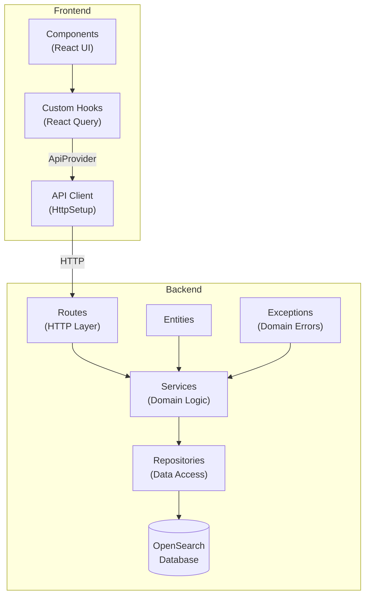

# Todo Plugin

A full-featured task management plugin for OpenSearch Dashboards with a clean, layered architecture.

## Features

- **Task Management**: Create, update status, delete, and search tasks.
- **Filtering & Search**: Search with status, priority filters.
- **Metrics & Analytics**: Overview metrics, detailed analytics with charts.

## Overview

This plugin implements the following architecture:




---

## Backend Architecture

### Layers

#### 1. **Routes** (`src/server/routes/`)
-  Handle HTTP requests/responses, validate input, route to appropriate service methods
#### 2. **Services** (`src/server/services/`)
-  Business logic, orchestration, data transformation

#### 3. **Repositories** (`src/server/infrastructure/repositories/`)
- Data access, implements respository interfaces.

#### 4. **Interfaces** (`src/server/infrastructure/ports/`)
- Define contracts for repositories (Dependency Inversion Principle)

#### 5. **Entities** (`src/server/domain/entities/`)
- Business rules and validation

### The `withService` Wrapper

**All TODO routes use the `withService` wrapper** to ensure consistent service injection and error handling:

```typescript
router.post(
  {
    path: API_ROUTES.TODOS,
    validate: { body: createTodoSchema }
  },
  withService(async (service, context, request, response) => {
    try {
      const result = await service.createTodo(request.body);
      return response.ok({ body: result });
    } catch (error) {
      return ErrorHandler.handle(error, response);
    }
  }, logger)
);
```

### Error Handling

Domain exceptions are translated to HTTP responses by `ErrorHandler`:

1. Domain/Service throws domain exception
2. Route handler catches in try catch
3. `ErrorHandler.handle(error, response)` maps to HTTP status
4. Response sent to client with appropriate status code and message

### Conventions
- **Constants**: Define route paths in `src/common/constants/index.ts`
- **Mappers**: Use `TodoMapper` to convert between domain entities and persistence/API models

---

## Frontend

### ApiProvider (`src/public/context/ApiContext.tsx`)

Provides OpenSearch Dashboards `HttpSetup` instance to all components via React Context:

```typescript
// Usage in components/hooks
const { http } = useApi();
const result = await http.post('/api/todo_plugin/todos', { body: JSON.stringify(data) });
```

OpenSearch Dashboards requires access to its core HTTP client for API calls. This provider makes it available throughout the React tree.

### React Query (`@tanstack/react-query v4`)

**Server state management** with automatic caching, refetching, and background updates:

```typescript
// Query (GET)
const { data, isLoading } = useTodos(params);

// Mutation (POST/PUT/DELETE)
const { mutate, isPending } = useCreateTodo();
mutate(todoData);
```

- Queries cached by key (e.g., `['todos', params]`)
- Mutations invalidate related queries to refetch fresh data
- UI updates immediately before server confirms, using queryClient.
- Query keys Centralized in `src/public/constants/queryKeys.ts`

**Pattern:**
- All API calls wrapped in custom hooks, using ApiProvider (`useTodos`, `useCreateTodo`, etc.)
- Mutations invalidate `TODOS`, `METRICS`, `OVERVIEW_METRICS` on success to keep data updated.


### Routes

Uses react-router, since it's the default package already included.

```typescript
<Routes>
  <Route path="/" element={<Overview />} />     // Dashboard with metrics cards
  <Route path="/metrics" element={<Metrics />} /> // Detailed charts & analytics
</Routes>
```

**Navigation:**
- Sidebar links in `MainLayout` component

---

## Testing

### Running Tests

**Important:** Tests must be run inside the Docker container:

```bash
# 1. Enter the container

# 2. Navigate to plugin directory
cd .../plugins/custom_plugin

# 3. Run tests
yarn test
```

### Test Helpers (`src/public/__test-utils__/`)

#### **`renderWithProviders`** - For components

```typescript
import { renderWithProviders } from '../../__test-utils__/helpers/renderWithProviders';

test('renders TodoForm', () => {
  const { getByText, queryClient, httpSetup } = renderWithProviders(<TodoForm />);

  // queryClient available for assertions
  // httpSetup available for mock verification
});
```

- Auto-wraps with all necessary providers (ApiProvider, QueryClientProvider, Router), returns `queryClient` and `httpSetup` for assertions.

#### **`renderHookWithProviders`** - For hooks

```typescript
import { renderHookWithProviders } from '../../__test-utils__/helpers/renderHookWithProviders';

test('useTodos fetches todos', async () => {
  const { result, waitFor, httpSetup } = renderHookWithProviders(() => useTodos());

  await waitFor(() => expect(result.current.isLoading).toBe(false));
  expect(httpSetup.get).toHaveBeenCalled();
});
```
- Wraps hooks with all providers (React Query needs QueryClientProvider)

#### **Mock Factories**

```typescript
import { createMockTodo, createMockTodoList } from '../../__test-utils__/mocks/mockTodos';
import { createMockPaginatedResponse } from '../../__test-utils__/mocks/mockResponses';
import { createMockHttpSetup } from '../../__test-utils__/mocks/mockHttpSetup';

// Create single todo with overrides
const todo = createMockTodo({ title: 'Custom title', status: TodoStatus.COMPLETED });

// Create list of 10 todos
const todos = createMockTodoList(10);

// Create paginated response
const response = createMockPaginatedResponse(todos);

// Mock HTTP client
const http = createMockHttpSetup();
http.get.mockResolvedValue(response);
```